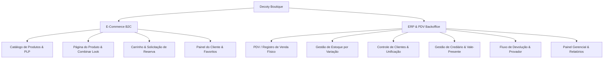

# 🛍️ Decoty Boutique - E-commerce & ERP Especializado em Moda


> **Um sistema de gestão de varejo ponta-a-ponta (E-commerce & ERP/PDV), focado na integridade financeira e na experiência do usuário.**

## 1. Visão Geral do Produto

O sistema **Decoty Boutique** é um ecossistema unificado para gestão e venda de moda, composto por duas grandes frentes:

1. **E-commerce B2C**: Portal web para clientes finais visualizarem o catálogo, gerenciarem favoritos, montarem carrinhos de compras e solicitarem a reserva de pedidos com integração para finalização via WhatsApp ou métodos digitais.

2. **ERP & PDV Interno**: Sistema interno de backoffice utilizado pela equipe de vendas e gerência. Permite o controle integral de estoque por variante (cor/tamanho), gestão financeira de clientes (crediário e vale-presente), registro de vendas (PDV), devoluções parciais, controle de provador externo e relatórios gerenciais avançados, integrado à nuvem através do **Supabase** (PostgreSQL, Auth e Storage).


## 2. Personas do Sistema

| Persona | Nível de Acesso | Responsabilidades & Fluxos Principais |
| :--- | :--- | :--- |
| **Cliente (Customer)** | E-commerce B2C | Navegar no catálogo, filtrar peças, favoritar itens (por cor), gerenciar carrinho, enviar solicitação de reserva e atualizar dados cadastrais no portal. |
| **Vendedor (Salesperson)** | ERP / PDV | Efetuar vendas no balcão, gerenciar o estoque diário de peças, enviar itens para o provador de clientes, receber pagamentos de parcelas de crediário e cadastrar novos clientes da loja. |
| **Gerente (Manager)** | ERP Administrativo | Tudo o que o vendedor faz, acrescido de acesso a relatórios gerenciais de faturamento e lucro, controle da equipe (ativar/desativar usuários e alterar permissões), cadastro de fornecedores e parametrização de taxas/descontos. |


## 3. Funcionalidades do Sistema (Mapeamento Funcional)



### 3.1. Módulo E-commerce B2C (Loja Online)

#### A. Catálogo e Filtros (Product Listing Page - PLP)
- **Navegação Dinâmica**: Exibição em grid com fotos principais de cada peça.
- **Filtros Avançados**: Filtragem por Categoria, Marca, Tamanho (P, M, G, etc.), Faixa de Preço (slider dinâmico) e Cor.
- **Ordenação**: Classificação por Menor Preço, Maior Preço e Novidades.
- **Skeleton Loading**: Componente `PLPSkeleton` para exibição de carregamento fluido das imagens.

#### B. Detalhes do Produto (Product Details Page - PDP)
- **Carrossel de Imagens Multicor**: Galeria que se ajusta automaticamente com base na cor selecionada pelo cliente.
- **Grade de Tamanhos**: Validação dinâmica de estoque por tamanho na variação de cor escolhida (tamanhos esgotados ficam desabilitados).
- **Funcionalidade "Complete o Look"**: Exibição inteligente de peças combinatórias associadas à variante de cor selecionada (ex: se o cliente olha uma saia jeans azul, o sistema exibe opções de blusas pré-vinculadas para aquela cor específica).
- **Lista de Desejos (Favoritos)**: Permite ao cliente favoritar um produto associado a uma cor específica. Os favoritos são guardados no banco de dados e sincronizados no menu superior.

#### C. Carrinho de Compras e Fluxo de Reserva (Checkout)
- **Carrinho Lateral (Drawer)**: Acesso rápido, contendo listagem com foto da cor escolhida, tamanho, preço unitário, quantidade e subtotal geral.
- **Reserva do Pedido (Checkout simplificado)**: O cliente preenche seus dados de entrega/retirada, escolhe a forma de pagamento pretendida e o sistema gera uma solicitação de reserva (`OrderReservation`).
- **Integração WhatsApp**: Ao finalizar, o cliente é direcionado ao WhatsApp da loja com uma mensagem pré-formatada contendo todos os dados do pedido para atendimento personalizado.

---

### 3.2. Módulo ERP & PDV (Painel Administrativo)

#### A. Frente de Caixa / PDV (`SalesPage` & `NewSaleModal`)
- **Montagem do Carrinho no Balcão**: Inserção de produtos através de busca textual ou ID humano (`ui_id`).
- **Parametrização da Venda**:
  - Aplicação de **descontos extras** (em valor fixo ou percentual).
  - Resgate de saldo de **Vale-Presente** do cliente selecionado para amortizar o total.
  - Snapshot de taxas financeiras aplicadas no momento da venda (permitindo saber exatamente o valor líquido que a loja receberá).
- **Multi-Formas de Pagamento**: PIX, Cartão de Débito, Cartão de Crédito (com número de parcelas) e **Crediário**.
- **Baixa Automática de Estoque**: Cada venda reduz automaticamente as quantidades específicas das variações vendidas no banco de dados e registra uma movimentação de estoque de saída (`StockEntry`).

#### B. Gestão de Clientes e Unificação Inteligente (`ClientList` & `LinkClientModal`)
- **Cadastro Detalhado**: Nome, CPF (com máscara automática), Celular (WhatsApp indicador), E-mail, Endereço completo (CEP integrado) e permissões de crédito (Pode Provador).
- **Fluxo de Unificação de Clientes (Merge)**:
  - **Problema resolvido**: Clientes cadastrados fisicamente na loja física (`store_only`) criam contas no site (`site_only`), gerando duplicidade de CPF/E-mail.
  - **Solução (Merge)**: O sistema analisa o banco e permite unificar a conta física e a conta digital.
  - **Lógica de Consolidação**:
    - Prioridade de dados cadastrais para os registros do ERP (Loja).
    - Preservação do `user_id` de autenticação do site para garantir que o cliente continue logado.
    - **Soma geométrica de saldos**: O saldo devedor do crediário e o saldo acumulado de vales-presentes são somados (sem perda de dados).
    - **Migração de Relacionamentos**: Todas as vendas antigas, históricos de estoque e logs do cliente antigo são atualizados no banco de dados para apontar para o novo ID unificado.
    - O registro duplicado é deletado ou limpo logicamente para evitar violação de constraints exclusivas de CPF.

#### C. Gestão de Crediário (Controle de Crédito Próprio)
- **Limite e Saldo Devedor**: O sistema mantém o `saldo_devedor_crediario` atualizado para cada cliente.
- **Fluxo de Pagamento de Parcelas (`CrediarioPaymentModal`)**:
  - O vendedor pode abater o valor devedor de forma genérica (amortizando a dívida total) ou vinculando o pagamento a itens de vendas específicos.
  - **Diluição de Pagamento**: Se o cliente faz um pagamento parcial genérico, o sistema distribui o valor proporcionalmente entre as vendas em aberto do mais antigo para o mais recente, atualizando o status dos itens para `pago` ou `pendente`.
  - Histórico detalhado de recebimentos com indicação de responsável, data, método de pagamento físico utilizado e taxas aplicadas.

#### D. Movimentação e Ajuste de Estoque (`StockList` & `StockAdjustmentPage`)
- **Log de Inventário**: Rastreabilidade total de entradas e saídas de produtos.
- **Motivos de Movimentação**:
  - Cadastro de produto (Entrada automática).
  - Venda de produto (Saída automática).
  - Ajuste manual (Avaria, Furto, Balanço).
  - **Envio para Provador Externo** (Saída temporária do estoque físico para a sacola do cliente).
  - **Retorno de Provador** (Entrada de retorno de peças não compradas pelo cliente).

#### E. Devoluções e Reembolsos Parciais (`SaleDetailsModal`)
- **Logística Reversa**: O sistema permite a devolução item a item de uma venda concluída.
- **Lógica de Amortização Financeira**:
  - Se o item devolvido **já estava pago**: o valor correspondente é creditado automaticamente no saldo de **Vale-Presente** do cliente (para compras futuras).
  - Se o item devolvido **estava em aberto no Crediário**: o valor correspondente é subtraído diretamente da dívida ativa do cliente.
  - As peças devolvidas retornam automaticamente ao estoque de vendas, gerando uma `StockEntry` de entrada com o motivo "Devolução de Venda".

#### F. Relatórios Gerenciais e Auditoria (`ManagementReportPage`)
- **Gráfico de Evolução de Faturamento**: Linha do tempo diária exibindo o faturamento líquido.
- **Indicadores Rápidos (KPIs)**: Faturamento bruto, custos totais das mercadorias vendidas (CMV), faturamento líquido (deduzindo taxas e descontos), taxa de devolução e lucratividade média.
- **Visualização por Categoria/Marca**: Tabela de produtos mais vendidos para guiar decisões de compras de coleções futuras.

#### G. Configurações da Loja e Permissões (`ErpSettingsPage` & `TeamList`)
- **Taxas Financeiras**: Configuração exata das taxas cobradas pelas maquininhas de cartão (Débito, Crédito à Vista e Crédito Parcelado).
- **Descontos por Método**: Configuração de descontos automáticos concedidos para PIX, Débito e Crédito Spot.
- **Gestão de Equipe**: Habilitação e desabilitação de operadores e alteração de papéis entre *Gerente* e *Vendedor*.
- **Store Access Hash**: Chave hash de acesso de segurança para controle de autorizações administrativas na loja.

---

## 4. Mapeamento da Estrutura de Pastas

A estrutura do projeto segue o padrão de aplicações modernas em React com TypeScript, empacotadas via **Vite**, organizadas de forma modular e limpa.

```
decoty-boutique/
│
├── .env                    # Variáveis de ambiente locais (Supabase keys)
├── .env.example            # Exemplo de configuração de variáveis de ambiente
├── .gitignore              # Arquivos e pastas ignorados pelo Git
├── index.html              # Template HTML principal
├── package.json            # Manifesto de dependências e scripts npm
├── tsconfig.json           # Configurações do compilador TypeScript
├── vercel.json             # Configuração de deploys e rewrites para a Vercel
├── vite.config.ts          # Configurações do bundler Vite
│
└── src/                    # Código-fonte da aplicação
    ├── App.tsx             # Roteador principal e injeção de Providers globais
    ├── main.tsx            # Ponto de entrada de renderização do React
    ├── index.css           # Estilos globais e tokens de design vanilla CSS
    ├── constants.ts        # Dados fixos de tamanho utilizados no cadastro de produtos
    ├── vite-env.d.ts       # Declarações de tipos de ambiente do Vite
    │
    ├── types/
    │   └── index.ts        # Interfaces globais TypeScript (Product, Sale, Client, etc.)
    │
    ├── utils/
    │   ├── colorUtils.ts   # Utilitários de tradução e manipulação de cores das peças
    │   └── index.ts        # Máscaras de CPF/Telefone, formatações de moeda e datas
    │
    ├── services/
    │   ├── supabaseClient.ts  # Inicialização e configuração do cliente Supabase
    │   ├── supabaseService.ts # Serviços auxiliares e verificações de RLS
    │   └── backendService.ts  # Ponte de API híbrida (Supabase <-> LocalStorage Fallback)
    │
    ├── contexts/
    │   ├── AuthContext.tsx # Estado de autenticação (Loja B2C e ERP Operadores)
    │   ├── CartContext.tsx # Gerenciador de estado do carrinho do E-commerce
    │   └── DataContext.tsx # Provedor de dados ERP, cache de listagens e relatórios
    │
    ├── layouts/
    │   ├── ErpLayout.tsx   # Painel administrativo (Menu lateral, modo escuro, perfil)
    │   └── SiteLayout.tsx  # Layout da loja online (Cabeçalho com sacola, Rodapé)
    │
    ├── components/
    │   ├── ui/             # Componentes base e primitivos de interface
    │   │   ├── Badge.tsx   # Tags visuais de status coloridas
    │   │   ├── Button.tsx  # Botões com variantes de estilo e estados de clique
    │   │   ├── Card.tsx    # Containers de conteúdo estruturados
    │   │   └── Pagination.tsx # Navegação de listagens longas
    │   │
    │   ├── shared/         # Componentes compartilhados entre ERP e Site
    │   │   ├── BrandLogo.tsx    # Elemento visual da logo Decoty Boutique
    │   │   ├── ProtectedRoute.tsx # Protetor de rotas privadas baseado em login/role
    │   │   └── UserMenu.tsx     # Menu flutuante de ações de conta do usuário
    │   │
    │   ├── site/           # Componentes específicos da loja online (B2C)
    │   │   ├── Navbar.tsx       # Barra de navegação B2C com favoritos e sacola
    │   │   ├── Footer.tsx       # Rodapé corporativo e links informativos
    │   │   ├── CartDrawer.tsx   # Painel lateral do carrinho de compras
    │   │   ├── FilterSidebar.tsx # Filtros da listagem de produtos do catálogo
    │   │   ├── ProductCard.tsx  # Card individual de exibição de produto na PLP
    │   │   ├── SizeGuideModal.tsx # Modal interativa com tabela de medidas de roupas
    │   │   └── PLPSkeleton.tsx  # Esqueleto de pré-carregamento visual para a PLP
    │   │
    │   └── erp/            # Componentes avançados do backoffice administrativo
    │       ├── ClientFormModal.tsx      # Cadastro e edição de clientes
    │       ├── CrediarioPaymentModal.tsx # Lançamento de pagamentos de dívidas
    │       ├── DetailedReportModal.tsx   # Exibição analítica de lucros/custos
    │       ├── GiftCardAdjustmentModal.tsx # Ajuste de saldo de vale-presente do cliente
    │       ├── LinkClientModal.tsx       # Tela de unificação de clientes duplicados
    │       ├── NewSaleModal.tsx         # Interface do PDV para registro de novas vendas
    │       ├── SaleDetailsModal.tsx     # Extrato da venda, devoluções e cancelamentos
    │       ├── SalesChart.tsx           # Gráfico vetorial de vendas por período
    │       └── SupplierFormModal.tsx    # Cadastro e edição de fornecedores
    │
    └── pages/
        ├── auth/           # Telas de controle de acesso ao ERP
        │   ├── LoginPage.tsx            # Login de funcionários
        │   ├── RegisterPage.tsx         # Registro de novos operadores
        │   ├── ForgotPasswordRequest.tsx # Solicitação de recuperação de senha
        │   └── ResetPasswordPage.tsx    # Redefinição de senha de acesso
        │
        ├── site/           # Páginas do e-commerce (Loja online B2C)
        │   ├── HomePage.tsx             # Banner principal e coleções em destaque
        │   ├── ProductListingPage.tsx   # Catálogo geral de peças com filtros
        │   ├── ProductDetailsPage.tsx   # Detalhes, seleção de cor/tamanho e looks
        │   ├── CheckoutPage.tsx         # Resumo do pedido e dados de contato
        │   ├── CustomerLoginPage.tsx    # Login do cliente final (Site)
        │   ├── CustomerProfilePage.tsx  # Histórico de reservas de pedidos
        │   ├── CustomerSettingsPage.tsx # Edição de dados pessoais e endereços
        │   └── FavoritesPage.tsx        # Galeria de peças favoritadas pelo cliente
        │
        └── erp/            # Páginas administrativas e operacionais (Backoffice)
            ├── DashboardHome.tsx        # Painel de resumo de vendas e atalhos rápidos
            ├── ClientList.tsx           # Painel de gestão de clientes e unificação
            ├── ClientHistoryPage.tsx    # Visão 360° do cliente (Ficha financeira)
            ├── SupplierList.tsx         # Painel de gestão de fornecedores parceiros
            ├── ProductList.tsx          # Painel de controle de catálogo interno
            ├── ProductFormPage.tsx      # Formulário avançado de peças e fotos
            ├── StockList.tsx            # Ficha de estoque por cor e tamanho
            ├── StockAdjustmentPage.tsx  # Ajuste de inventário (Balanço, Provador)
            ├── SalesPage.tsx            # Extrato geral de vendas e faturamento do dia
            ├── TeamList.tsx             # Gestão de permissões de operadores
            ├── ErpProfilePage.tsx       # Dados da conta do funcionário conectado
            └── ErpSettingsPage.tsx      # Ajustes de taxas operacionais da loja
```

---

## 5. Fluxos Críticos e Arquitetura de Integração

### 5.1. Fluxo 360° de Vendas no Crediário e Devoluções

```
[Venda no PDV] ──(Dívida)──> [Cliente: Saldo Devedor Aumenta]
      │
(Devolução Parcial de Item Pago) ──> [Gera saldo de Vale-Presente]
      │
(Devolução Parcial de Item Não Pago) ──> [Subtrai do Saldo Devedor]
```

## 5.2 Tech Stack

O projeto foi construído focando em performance, tipagem estática e segurança.

**Frontend:**
- **Core:** React 18 + TypeScript
- **Build Tool:** Vite
- **Estilização:** Tailwind CSS (com suporte nativo a Dark Mode e Layout Híbrido Desktop/Mobile)
- **Componentes Visuais:** Lucide React (Ícones), Recharts (Gráficos Financeiros)
- **Roteamento:** React Router DOM v6

**Backend & Infraestrutura:**
- **BaaS:** Supabase
- **Banco de Dados:** PostgreSQL (Garante integridade referencial e constraints rigorosas)
- **Autenticação:** Supabase Auth + Proteção interna via SHA-256 (Web Crypto API)

**Infraestrutura de Build:**
- **Módulo:** ESModules (importação direta via ESM.sh)
- **Segurança:** Criptografia SHA-256 via Web Crypto API para validação de acesso.

## 6. Algumas Screenshots (ERP Interface)

**Tela de login:**
- **Descrição:** Usuário do sistema efetua login ou faz um novo cadastro (sistema verifica se está conectado em produção).

<br> </br>

**Tela de cadastro:**
- **Descrição:** Processo de cadastro do usuário no sistema (usuário será informado diretamente pelo gerente sobre qual é a palavra-chave para concluir o cadastro).

<br> </br>

**Tela Home:**
- **Descrição:** Tela mostra indicadores de venda do dia e da semana e as vendas mais recentes.

<br> </br>

**Tela de Detalhes da Venda:**
- **Descrição:** Exibe todos os dados da venda, itens, tipo de pagamento, status de pagamento Taxas de maquininha, entre outros dados (tambem é possivel vincular o cliente posteriormente a venda).

<br> </br>

**Tela de Movimentação de Estoque:**
- **Descrição:** Tela mostra todas as movimentações de ENTRADA e SAÍDA das quantidades de estoque de cada item.

<br> </br>

**Tela de Listagem de clientes:**
- **Descrição:** Lista todos os clientes cadastrados no sistema, e mostra alguns dados pertinentes para controle (vale presente e se há pendendencias de crediário/carnê).

<br> </br>

**Tela de Detalhes do cliente:**
- **Descrição:** Nessa tela o usuário pode detalhes do cliente, alterar dados do cliente caso necessário e consultar as peças que estão com o cliente por motivos de provador, realizar o pagamento das vendas de crediário desse cliente, entre outros.

<br> </br>

**Fluxo de crediário:**
- **Descrição:** Usuário do sistema consulta quais são as vendas tipo crediário do cliente para que possa efetuar o pagamento.

<br> </br>

- **Descrição:** Sistema mostra o "histórico de pagamento" da venda de creiário para que o usuário não perca o controle sobre o saldo vigente.

<br> </br>

**Tela de relatório gerencial:**
- **Descrição:** Dados detalhados de toda a operação, vendas bruto, CMV, lucro líquido, futuras entradas de crédito, devoluções, taxas, entre outros.


---

## 7. Modo Claro ou Escuro

- **Descrição:** O sistema tem suporte a modo claro e escuro para facilitar a visualização em ambientes iluminados ou melhorar a experiencia de uso em ambientes mais escuros.

<br> </br>


## 8. Responsividade

- **Descrição:** O sistema é responsivo e se adpta a diferentes tamanho de tabela: PC / Tablet / Celular.

<p align="center">
  
  &nbsp;&nbsp;&nbsp;&nbsp;
  
</p>

